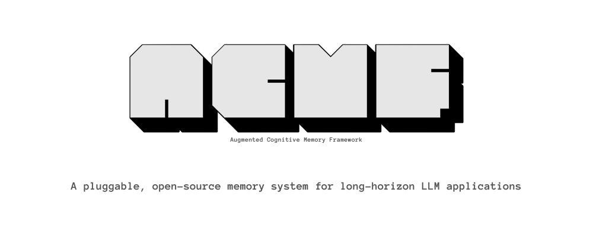

<p align="center">
  
</p>

<p align="center">
  <a href="https://github.com/ambroseacoulter/aCMF/blob/main/LICENSE"></a>
  <a href="https://ecmf.mintlify.app"></a>
  <a href="https://developers.openai.com/api/docs/models"></a>
  <a href="https://ecmf.mintlify.app/quickstart"></a>
</p>

# aCMF

aCMF is an open-source long-term memory sidecar for LLM applications.

It is not an agent framework. Your host application calls aCMF before a turn to retrieve grounded context, and after a turn to process durable memory asynchronously. aCMF stores canonical memory state in PostgreSQL, embeddings in pgvector, projects graph state into Neo4j for traversal-heavy reads, and runs background maintenance through Celery.

## Concept

The core claim behind aCMF is that durable memory should be externalized from the primary LLM runtime and governed as its own subsystem, not improvised inside the prompt window or delegated to indiscriminate retrieval.

The host model remains optimized for immediate reasoning and response generation, while memory-specific responsibilities are decomposed into explicit stages: structured adjudication, hybrid persistence, asynchronous consolidation, scheduler-driven retrieval, and compressed state delivery back to the host only when retrieval gates open.

That design addresses the three common failure modes of long-horizon LLM systems:

- prompt-only memory causes context drift and poor scaling
- retrieval-only memory introduces irrelevant or stale recall under latency pressure
- write-everything memory retains noise, weakens summaries, and increases attack surface

Instead of treating memory as a flat store, aCMF treats it as a governed lifecycle. Facts are evaluated before persistence, stored with provenance and temporal context, maintained off the synchronous path, and surfaced back to the host as bounded grounded context rather than raw history dumps.

Conceptually, the system follows a five-tier model:

1. `River`
   - the low-latency working set for active turn handling, task continuity, and immediate host-side state
   - represented operationally by the host application's active conversation state and the scoped retrieval request it issues to aCMF
2. `Adjudicator`
   - the governance layer that decides what graduates into durable memory and how it should be represented
   - implemented through the async `/v1/process` pipeline and worker orchestration
   - converts turns into structured memory operations using search-first tool calls, staged writes, provenance capture, and atomic commit validation
3. `Hybrid Store`
   - a multi-representation memory substrate spanning semantic recall, temporal/relational structure, and exact canonical state
   - implemented as canonical PostgreSQL memory tables, pgvector embeddings for semantic recall, and Neo4j as a projection for traversal-heavy graph reads
   - supports explicit contradiction, lineage, scope, and graph-aware retrieval rather than a single undifferentiated memory format
4. `Reflective Cortex`
   - the asynchronous maintenance plane for consolidation, decay, contradiction repair, supersession, and snapshot preparation
   - implemented as hourly background maintenance
   - recomputes memory health, proposes decay and duplicate actions, reviews ambiguous changes, and regenerates user/global snapshots off the critical path
5. `Bulletin`
   - the compressed delivery layer that returns a small grounded state packet to the host, with deeper evidence only when required
   - implemented through `/v1/context` and `/v1/deep-memory`
   - returns either a concise grounded context packet or a deeper evidence-backed response, both subject to strict relevance gating and abstention rules

## What aCMF does

- Stores durable memory for many users inside one deployed service.
- Supports scoped memory at `user`, `global`, and optional `container` levels.
- Retrieves memory through hybrid search: snapshot refs, vector similarity, metadata ranking, and graph expansion, then applies strict query-relevance gating before anything is exposed publicly.
- Uses separate LLM roles for adjudication, context enhancement, and cortex review/summary.
- Detects contradictions, duplicates, lineage, and memory decay.
- Maintains one latest hourly user snapshot built from `user` and `global` memory only.

## Architecture

### Canonical stores

- PostgreSQL is the system of record for users, containers, turns, memories, contradiction groups, lineage events, jobs, snapshots, and canonical graph tables.
- pgvector stores memory embeddings for similarity search.
- Redis is the Celery broker and result backend.
- Neo4j is a projection of graph state optimized for graph traversal and neighborhood expansion. It is not the write source of truth.

### LLM roles

- `Adjudicator`
  - Runs only in post-turn async processing.
  - Investigates the turn plus existing memory through tools.
  - Stages memory and graph operations one item at a time.
  - The application validates and commits staged operations atomically.
- `Context Enhancer`
  - Runs on `/v1/context`.
  - Receives the user message plus ranked evidence.
  - Produces a concise XML context block or abstains.
- `Deep Memory`
  - Uses the same retrieval pipeline as context enhancement but answers a grounded memory query.
  - Must abstain when evidence is weak or conflicting.
- `Cortex`
  - Hourly maintenance is computed programmatically first.
  - Cortex reviews the proposal bundle through staged review tools.
  - After review, a separate Cortex prompt writes the snapshot summary.

### Staged tool workflow

- Adjudicator and Cortex do not write directly to canonical tables.
- They interact through staged tool sessions.
- Each session is validated before commit.
- The application then applies all valid operations in one transaction.

This keeps the LLM flexible without giving it direct write access to the database.

## Repository layout

- `app/api`
  - FastAPI routes and Pydantic request/response schemas.
- `app/core`
  - configuration, enums, logging, shared settings.
- `app/db`
  - SQLAlchemy models, session management, Alembic environment and baseline migration.
- `app/storage`
  - repository layer for canonical persistence.
- `app/services`
  - memory commit logic, embeddings, relevance, scoring, staged tool sessions, maintenance proposal generation.
- `app/retrieval`
  - scope resolution, vector search, reranking, graph search models.
- `app/llms`
  - OpenAI-compatible clients, prompt renderers, role integrations, prompt templates.
- `app/engines`
  - orchestration for read paths, graph persistence, process flow, snapshots, and cortex.
- `app/workers`
  - Celery app, process-turn worker, hourly cortex worker, graph projection sync worker.
- `tests`
  - route, service, and worker coverage.

## Runtime flow

### 1. Pre-turn context

Your app calls `POST /v1/context`.

- aCMF resolves the requested scope.
- It retrieves raw candidates from snapshot refs, vector search, metadata ranking, and Neo4j graph traversal.
- It removes unrelated candidates through strict query-relevance gating.
- It reranks only the remaining relevant candidates.
- It sends the user message plus relevant evidence to the Context Enhancer only if relevant evidence remains.
- It returns either:
  - a grounded XML block for prompt injection, or
  - an abstention with diagnostics.

### 2. Post-turn processing

Your app calls `POST /v1/process`.

- aCMF creates the user and missing containers if needed.
- It stores a background job and returns immediately.
- The worker persists a normalized turn record.
- The Adjudicator searches memory and graph context through tools.
- It stages memory creates, updates, merges, contradiction actions, entities, relations, and links.
- aCMF validates the staged ledger and commits it atomically.
- Embeddings are created or refreshed.
- Touched memories get relevance updates.
- The user snapshot is marked dirty.
- Newly created graph outbox events are dispatched for immediate async Neo4j projection after commit.

### 3. Hourly maintenance

Celery beat schedules two recurring jobs.

- `hourly_cortex`
  - recomputes decay and status,
  - proposes duplicates and contradiction candidates programmatically,
  - sends those proposals to Cortex for staged review,
  - commits approved maintenance changes,
  - generates the latest user/global snapshot summary.
- `sync_graph_projection`
  - consumes pending graph outbox events,
  - retries or drains projection backlog,
  - projects memory nodes, entities, relations, memory links, and graph edges into Neo4j.

## Public API

Endpoint docs:

- `/v1/process`: [Process](https://ecmf.mintlify.app/reference/process)
- `/v1/context`: [Context](https://ecmf.mintlify.app/reference/context)
- `/v1/deep-memory`: [Deep Memory](https://ecmf.mintlify.app/reference/deep-memory)
- `/v1/snapshot/{user_id}`: [Snapshot](https://ecmf.mintlify.app/reference/snapshot)

### `POST /v1/process`

Queues post-turn adjudication.

Request:

```jsonc
{
  "user_id": "user-123",
  "containers": [
    {
      "id": "thread-abc",
      "type": "thread" // Optional: informational container type
    }
  ], // Optional: missing containers are created automatically
  "scope_policy": {
    "write_user": "auto", // Optional: defaults to "auto"
    "write_global": "auto", // Optional: defaults to "auto"
    "write_container": true // Optional: defaults to true
  }, // Optional
  "turn": {
    "user_message": "Remember that I prefer pytest over unittest.",
    "assistant_response": "Understood. I'll keep that in mind.",
    "occurred_at": "2026-03-16T10:00:00Z", // Optional: source timestamp
    "user_message_id": "msg-u-1", // Optional
    "assistant_message_id": "msg-a-1" // Optional
  },
  "metadata": {
    "app": "example-host", // Optional
    "source": "chat", // Optional
    "model": "gpt-4.1-mini", // Optional
    "trace_id": "trace-001" // Optional
  } // Optional
}
```

Response:

```json
{
  "status": "accepted",
  "job_id": "3d8581a7-f102-4f45-8a77-fdcb16022c50",
  "created_user": true,
  "created_containers": [
    "thread-abc"
  ],
  "accepted_at": "2026-03-16T10:00:00.000000"
}
```

### `POST /v1/context`

Builds prompt-safe pre-turn context.

Request:

```jsonc
{
  "user_id": "user-123",
  "message": "Can you help me set up tests for this repo?",
  "containers": [
    {
      "id": "thread-abc",
      "type": "thread" // Optional: informational container type
    }
  ], // Optional
  "scope_level": "user_global_container", // Optional: defaults to "user_global"
  "read_mode": "balanced", // Optional: defaults to "balanced"
  "budgets": {
    "max_output_tokens": 400, // Optional
    "max_candidate_memories": 30 // Optional
  }, // Optional
  "metadata": {
    "app": "example-host", // Optional
    "trace_id": "trace-002" // Optional
  } // Optional
}
```

Response:

```json
{
  "status": "ok",
  "has_usable_context": true,
  "context_enhancement": "<contextenhancement>...</contextenhancement>",
  "abstained_reason": null,
  "diagnostics": {
    "scope_applied": "user_global_container",
    "read_mode": "balanced",
    "user_found": true,
    "candidate_count": 9,
    "used_memory_count": 3,
    "missing_containers": [],
    "source_breakdown": {
      "snapshot": 2,
      "vector": 4,
      "metadata": 3,
      "graph": 1
    },
    "evidence_strength": 0.78,
    "warnings": []
  }
}
```

Important response behavior:

- `candidate_count`, `used_memory_count`, and `source_breakdown` are relevance-gated.
- Unrelated raw retrieval hits stay internal and do not appear in the API payload.
- If no relevant memories survive gating, aCMF skips the Context Enhancer LLM and returns a zero-result style abstention.

The `context_enhancement` field uses this stable shape:

```xml
<contextenhancement>
  <scope>user_global_container</scope>
  <summary>...</summary>
  <active_context>...</active_context>
  <confidence_note>Use as supportive context, not unquestionable fact.</confidence_note>
</contextenhancement>
```

### `POST /v1/deep-memory`

Answers a grounded memory question using the same retrieval engine with deeper evidence handling.

Request:

```jsonc
{
  "user_id": "user-123",
  "query": "What testing framework does this user prefer?",
  "containers": [
    {
      "id": "thread-abc",
      "type": "thread" // Optional: informational container type
    }
  ], // Optional
  "scope_level": "user_global_container", // Optional: defaults to "user_global"
  "read_mode": "deep", // Optional: defaults to "balanced"
  "budgets": {
    "max_output_tokens": 500, // Optional
    "max_candidate_memories": 40 // Optional
  }, // Optional
  "metadata": {
    "trace_id": "trace-003" // Optional
  } // Optional
}
```

Important response behavior:

- The endpoint abstains directly when no relevant grounded evidence survives retrieval gating.
- `evidence` only contains memories actually used in the final answer.
- Public diagnostics remain relevance-gated, not raw-retrieval counts.

Response:

```json
{
  "status": "ok",
  "answer": "Based on stored memory, the user prefers pytest over unittest.",
  "abstained": false,
  "abstained_reason": null,
  "used_memory_count": 1,
  "diagnostics": {
    "scope_applied": "user_global_container",
    "read_mode": "deep",
    "user_found": true,
    "candidate_count": 12,
    "used_memory_count": 1,
    "missing_containers": [],
    "source_breakdown": {
      "snapshot": 2,
      "vector": 5,
      "metadata": 4,
      "graph": 1
    },
    "evidence_strength": 0.82,
    "warnings": []
  },
  "evidence": [
    {
      "memory_id": "mem-123",
      "scope_type": "user",
      "bucket_id": null,
      "relevance": 0.88,
      "support": 0.91,
      "relation_refs": [],
      "entity_refs": []
    }
  ]
}
```

### `GET /v1/snapshot/{user_id}`

Returns the latest hourly user/global snapshot.

Path parameter:

| Field | Required | Notes |
| --- | --- | --- |
| `user_id` | Yes | User identity whose latest snapshot should be returned. |

Response:

```json
{
  "status": "ok",
  "user_id": "user-123",
  "generated_at": "2026-03-16T10:00:00.000000",
  "snapshot": {
    "summary": "The user prefers pytest, is working on repository X, and has an active goal to improve automated testing coverage.",
    "memory_refs": [
      "mem-123",
      "mem-456"
    ],
    "health_note": "No major contradiction clusters affected the selected snapshot."
  }
}
```

### `GET /health`

Simple health response:

```json
{
  "status": "ok"
}
```

## Read modes

- `simple`
  - smallest candidate pool,
  - shallow graph expansion from relevant memory seeds,
  - lowest latency.
- `balanced`
  - default mode,
  - hybrid retrieval across vector, metadata, snapshot, and graph,
  - strict relevance gating before public output.
- `deep`
  - largest pool,
  - broader graph traversal,
  - stronger abstention behavior for weak evidence.

## Minimum environment variables

If you start from [.env.example](https://github.com/ambroseacoulter/aCMF/blob/main/.env.example) with stub providers, you can run locally without adding any extra provider credentials.

If you are configuring the app manually, the minimum runtime variables are:

- `ACMF_DATABASE_URL`
- `ACMF_REDIS_URL`
- `ACMF_NEO4J_URI`
- `ACMF_NEO4J_USERNAME`
- `ACMF_NEO4J_PASSWORD`

If you switch any role from `stub` to `openai_compatible`, you also need that role's API credentials and model configuration, either through role-specific vars or the shared OpenAI-compatible defaults.

Full environment reference:

- [guides/environment-reference.mdx](https://ecmf.mintlify.app/guides/environment-reference)

## Recommended models

Recommended OpenAI-compatible model choices by role:

| Role | Recommended models |
| --- | --- |
| Adjudicator | `openai/gpt-5.4` or `google/gemini-3.1-flash-lite-preview` |
| Context Enhancer | `openai/gpt-5.4`, `google/gemini-3.1-flash-lite-preview`, or `inception/mercury-2` for fast token speed |
| Cortex | `openai/gpt-5.4` or `google/gemini-3.1-flash-lite-preview` |
| Embedding | `openai/text-embedding-3-large` or `openai/text-embedding-3-small` |

Recommended starting point:

- use `openai/gpt-5.4` for adjudicator, context enhancer, and cortex if you want one consistent default
- use `inception/mercury-2` specifically for context enhancement if latency and token speed matter more than consistency
- use `openai/text-embedding-3-large` for higher-quality retrieval, or `openai/text-embedding-3-small` for lower cost and smaller vectors

## Local development

### Prerequisites

- Docker and Docker Compose
- Python 3.9+

### 1. Create environment config

```bash
cp .env.example .env
```

Edit `.env` and set your provider configuration. The checked-in example uses `stub` providers by default.

### 2. Start the stack

```bash
docker compose up --build
```

This starts:

- `api`
- `worker`
- `beat`
- `postgres`
- `redis`
- `neo4j`

Default ports:

- API: `8000`
- Postgres: `5432`
- Redis: `6379`
- Neo4j HTTP: `7474`
- Neo4j Bolt: `7687`

### 3. Automatic migrations in Docker

When you run:

```bash
docker compose up --build
```

each container waits for Postgres and runs:

```bash
alembic upgrade head
```

before starting its main process. The container entrypoint uses a Postgres advisory lock, so concurrent startup does not race migrations.

### 4. Automatic migrations outside Docker

If you start the API, worker, or beat directly, aCMF now applies pending Alembic migrations automatically during process startup as well.

Manual Alembic usage is still available if you want it:

```bash
python3 -m pip install -e ".[dev]"
alembic upgrade head
```

### 5. Run locally without Docker

```bash
python3 -m pip install -e ".[dev]"
uvicorn app.main:app --host 0.0.0.0 --port 8000
celery -A app.workers.queue.celery_app worker --loglevel=INFO
celery -A app.workers.queue.celery_app beat --loglevel=INFO
```

You still need reachable Postgres, Redis, and Neo4j instances.

## Operations notes

- Celery beat runs `hourly_cortex` every hour at minute `0`.
- `sync_graph_projection` runs every `300` seconds.
- Canonical graph writes dispatch immediate async projection after commit; beat remains the retry and backlog drain path.
- `/v1/process` is intentionally fast and only queues work.
- Retrieval paths soft-fail conservatively when evidence or synthesis is weak.
- `/v1/context` and `/v1/deep-memory` now expose only relevance-gated diagnostics and results.
- Snapshots include only `user` and `global` memories.
- Container-only memories are excluded from hourly snapshots by design.

## Testing

Run the test suite:

```bash
python3 -m pytest
```

Run a quick import sanity check:

```bash
python3 -c 'from app.main import app; print(app.title, app.version)'
```

## Current implementation notes

- Adjudicator and Cortex use staged tool sessions. Canonical writes remain application-controlled.
- Neo4j is projection-only. Recovery and correctness depend on Postgres, not Neo4j.
- Prompt files under `app/llms/prompts` are behavior contracts, not placeholder strings.
- Maintenance discovery is mostly programmatic; Cortex mainly reviews proposals and writes snapshot summaries.

## License

GPL-3.0-or-later. See [LICENSE](LICENSE).
